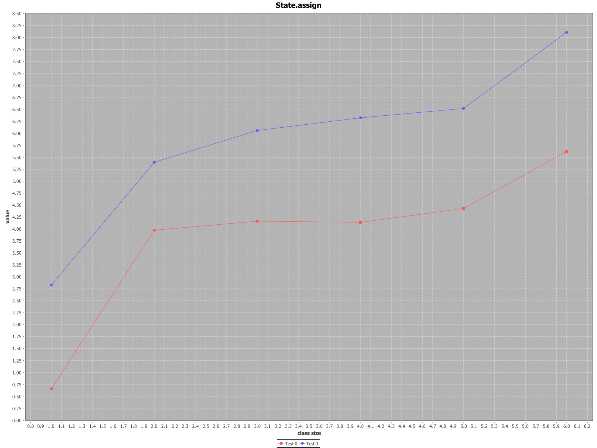
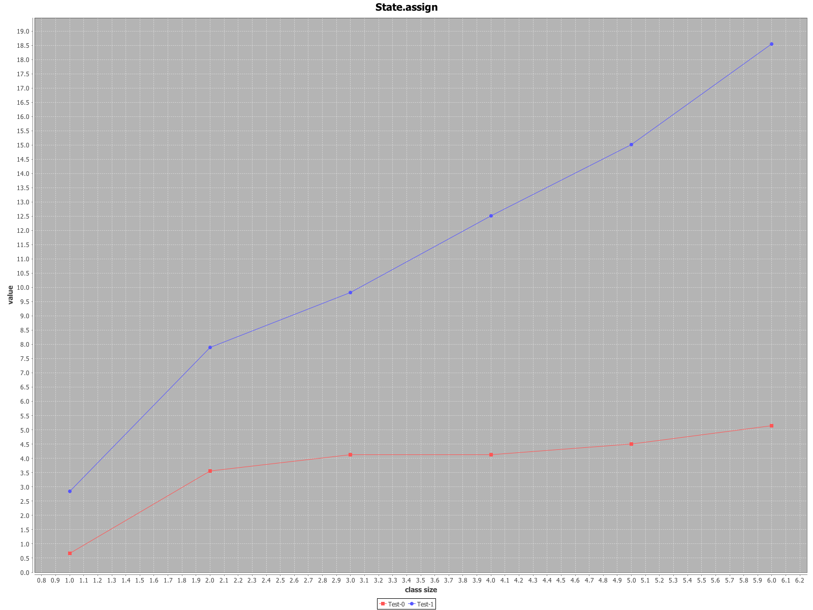

## Case class Var members vs. Val members

### Updating varying number of the case class members

Benchmarking state mutation via case class Var members (Test-0 curve) and Val members (Test-1 curve) i.e.

```scala
Foo( a: Int, b: Int, c: Int etc. )
```

 * X-axis: number of the case class members
 * Y-axis: millis to update all case class members 1 000 000 times.




### Updating varying number of the nested case classes

Benchmarking state mutation via updating a single class member nested in a different case class i.e.

```scala
Foo2( a: Int )
Foo1( a: Foo2 )
Foo( a: Foo1 )
```

Test-0 curve shows nested case classes with the Var members. Test-1 curve represents nested case classes
with the Val members.

 * X-axis: level of the nested member i.e. "depth"
 * Y-axis: millis to update the nested class member 1 000 000 times.



