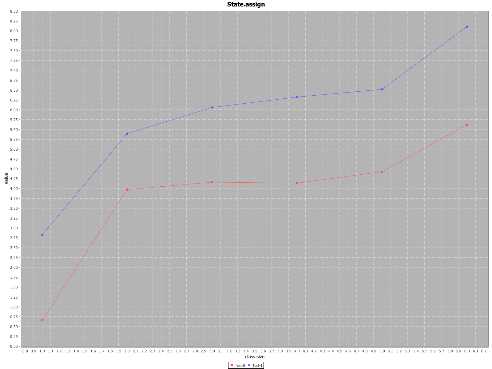

## Case class Var members vs. Val members

Benchmarking state mutation via case class Var members (Test-0 curve) and Val members (Test-1 curve).

 * X-axis: number of the case class members
 * Y-axis: millis to update all case class members 1 000 000 times.

